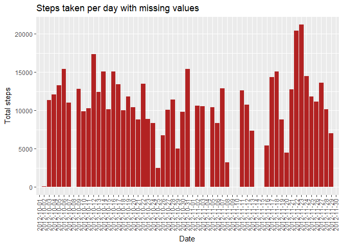
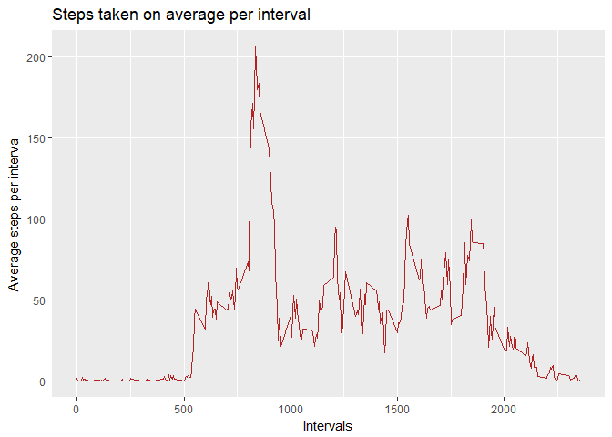
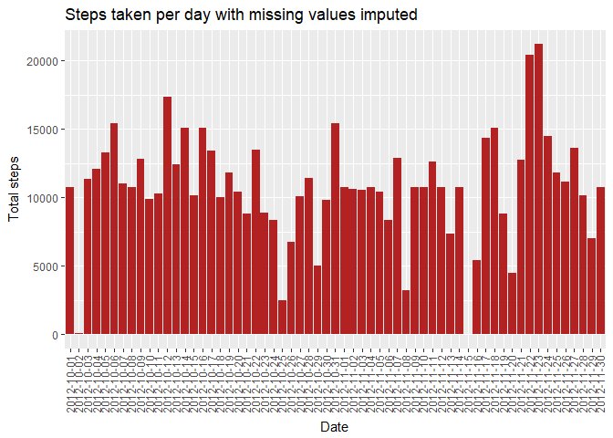
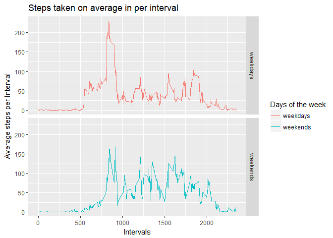

## Loading and preprocessing the data and libraries

1. Load the following libraries, otherwise the code will not work:


```r
library(dplyr)
library(ggplot2)
```

2. Load the data in a variable (`act` in this case):


```r
act <- read.table('activity.csv', sep = ',', header = T)
```

## Mean of the total number of steps taken per day

### Calculate the total number of steps taken per day

* Store in a variable (`sum`) the sum of the data grouped by the date:


```r
sum  <- act %>% group_by(date) %>% summarise(steps_sum = sum(steps, na.rm = T))
```

### Make a histogram of the total number of steps taken each day

* And then use the variable `sum` as a base for the plot:


```r
p <- ggplot(sum, aes(x = date, y = steps_sum))
p + geom_histogram(stat = 'identity', fill = 'firebrick') +
        labs(title = 'Steps taken per day with missing values', x = 'Date', 
             y = 'Total steps') +
        theme(axis.text.x = element_text(angle = 90, vjust = 0.4))
```

<!-- -->

## Calculate and report the mean and median of the total number of steps taken per day

* This step uses the same variable `sum`, under the code the resulsts are visible


```r
mean(sum$steps_sum)
```

```
## [1] 9354.23
```

```r
median(sum$steps_sum)
```

```
## [1] 10395
```

## Average of the daily activity pattern

* Store in a variable (`average`) the mean of the data grouped by the intervals:


```r
average <- act %>% group_by(interval) %>% summarise(steps_mean = mean(steps, na.rm = T))
```

### Time series plot of the 5-minute interval (x-axis) and the average number of steps taken, averaged across all days (y-axis)

* And then use the variable `average` as a base for the plot:


```r
p2 <- ggplot(average, aes(x = interval, y = steps_mean, group = 1))
p2 + geom_line(col = 'firebrick') + labs(title = 'Steps taken on average per interval', 
                                         x = 'Intervals',
                                         y = 'Average steps per interval') 
```

<!-- -->

## 5-minute interval, on average across all the days in the dataset, containing the maximum number of steps

* This step uses the same variable `average`, under the code the resulsts are visible


```r
max_avg <- which.max(average$steps_mean)
average[max_avg,1]
```

```
## # A tibble: 1 x 1
##   interval
##      <int>
## 1      835
```

## Imputing missing values

### Number of missing values in the dataset

* simple `length` function called on a `is.na` subset of `act`


```r
length(act[is.na(act[,1]),1])
```

```
## [1] 2304
```

### filling in all of the missing values in the dataset & creating a new dataset that is equal to the original dataset but with the missing data filled in

First i stored in `incomplete_values` all the rows of `act` with an `NA`, then I transformed `average` from a Tibble into a Data Frame for using it subsquently. After that I merged the `incomplete_values` and the `average` Data Frames by the column 'Interval', with a left outer join (`all.x = T`, and `x = incomplete_values`). I sorted the values by date first and interval second to break the ties, so to have the values ordered as in the original `act`. Finally I created a copy of `act`, `act2`, i subsetted all the `NA` values and I substituted them with the values from the fourth column of `sorted_values`, the mean by time intervals.


```r
incomplete_values <- act[is.na(act[,1]),]
average <- as.data.frame(average)
merged_values <- merge(incomplete_values, average, by = 'interval', all.x = T)

sorted_values <- merged_values[order(merged_values$date, merged_values$interval),]
act2 <- act
act2[is.na(act2[,1]),1] <- sorted_values[,4]
```

### histogram of the total number of steps taken each day and report of the mean and median of steps taken per day

* Store in a variable (`sum2`) the sum of the data grouped by the date:


```r
sum2  <- act2 %>% group_by(date) %>% summarise(steps_sum = sum(steps, na.rm = T))
```

* And then use the variable `sum2` as a base for the plot:


```r
p3 <- ggplot(sum2, aes(x = date, y = steps_sum))
p3 + geom_histogram(stat = 'identity', fill = 'firebrick') +
        labs(title = 'Steps taken per day with missing values imputed', x = 'Date',
             y = 'Total steps') + theme(axis.text.x = element_text(angle = 90, 
                                                                   vjust = 0.4))
```

<!-- -->

* This step uses the same variable `sum2`, under the code the resulsts are visible


```r
mean(sum2$steps_sum)
```

```
## [1] 10766.19
```

```r
median(sum2$steps_sum)
```

```
## [1] 10766.19
```

* Differences between the results


```r
mean(sum$steps_sum)-mean(sum2$steps_sum)
```

```
## [1] -1411.959
```

```r
median(sum$steps_sum)-median(sum2$steps_sum)
```

```
## [1] -371.1887
```

## Differences in activity patterns between weekdays and weekends

### Factor variable in the dataset with two levels – “weekday” and “weekend” indicating whether a given date is a weekday or weekend day

First I changed my locale so to have the names of the days in English, then I transformed the format of the date so to have the name of the week abbreviated. After that I added a new column, `days`, in which I stored the type of day of the week, `weekends` or `weekdays`. I factorized the column, gave it the name `days` and finally i grouped it by interval and days, summarising the mean of the steps.


```r
Sys.setlocale("LC_ALL","English")
```

```
## [1] "LC_COLLATE=English_United States.1252;LC_CTYPE=English_United States.1252;LC_MONETARY=English_United States.1252;LC_NUMERIC=C;LC_TIME=English_United States.1252"
```

```r
act2[,2] <- as.POSIXct(strptime(as.character(act2[,2]), '%Y-%m-%d'))
act2[,2] <- format(act2[,2], format = '%Y-%m-%a')

act2[,4] <- 'weekdays'
act2[grepl('Sat', act2[,2]) | grepl('Sun', act2[,2]),4] <- 'weekends'
act2[,4] <- as.factor(act2[,4])
colnames(act2) <- c('steps', 'date', 'interval', 'days')

act2_avg <- act2 %>% group_by(interval, days) %>%
        summarise(steps_mean = mean(steps, na.rm = T))
```

### Panel plot containing a time series plot of the 5-minute interval (x-axis) and the average number of steps taken, averaged across all weekday days or weekend days (y-axis)

* I used the variable `act2_avg` as a base for the plot:


```r
p4 <- ggplot(act2_avg, aes(x = interval, y = steps_mean, col = days))
p4 + geom_line() +labs(title = 'Steps taken on average in per interval', 
             x = 'Intervals', y = 'Average steps per Interval',
             col = 'Days of the week') + facet_grid(days~.)
```

<!-- -->
 

